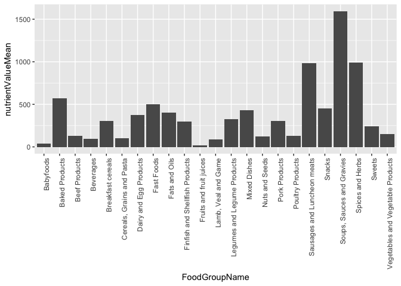

Health Canada Nutrient Data
================
sh2042

Canadian Nutrient File (CNF) is a computerized food composition database which provides information on the nutritional content values of foods sold in Canada. This report aims to look at the sodium content in foods sold in Canada. For more information, please visit <https://www.canada.ca/en/health-canada/services/food-nutrition/healthy-eating/nutrient-data/canadian-nutrient-file-2015-download-files.html>, where the original data was borrowed from.

``` r
library(dplyr) # manipulate data
```

    ## Warning: package 'dplyr' was built under R version 3.4.2

    ## 
    ## Attaching package: 'dplyr'

    ## The following objects are masked from 'package:stats':
    ## 
    ##     filter, lag

    ## The following objects are masked from 'package:base':
    ## 
    ##     intersect, setdiff, setequal, union

``` r
library(ggplot2) # graph data
```

``` r
# read in the csv files
foodName <- read.csv("FOOD NAME.csv")
foodGroup <- read.csv("FOOD GROUP.csv")
nutrientAmount <- read.csv("NUTRIENT AMOUNT.csv")
nutrientName <- read.csv("NUTRIENT NAME.csv")
```

The 2 tables below will be combined based on thier common nutrientID. Nutrient Amount contains the amount of each nutrient availible in a food product, where the Nutrient Name, contains the names corresponding to the nutrient code in Nutrient Amount.

``` r
head(nutrientAmount)
```

    ##   FoodID NutrientID NutrientValue StandardError NumberofObservations
    ## 1      2        203          9.54             0                    0
    ## 2      2        204         15.70             0                    0
    ## 3      2        205          5.91             0                    0
    ## 4      2        207          1.67             0                    0
    ## 5      2        208        204.00             0                    0
    ## 6      2        221          0.00            NA                    0
    ##   NutrientSourceID NutrientDateOfEntry
    ## 1              102          2010-04-16
    ## 2              102          2010-04-16
    ## 3              102          2010-04-16
    ## 4              102          2010-04-16
    ## 5              102          2010-04-16
    ## 6               12          2004-09-13

``` r
head(nutrientName)
```

    ##   NutrientID NutrientCode NutrientSymbol NutrientUnit
    ## 1        203          203           PROT            g
    ## 2        204          204            FAT            g
    ## 3        205          205           CARB            g
    ## 4        207          207            ASH            g
    ## 5        208          208           KCAL         kCal
    ## 6        810          209           STAR            g
    ##                          NutrientName                       NutrientNameF
    ## 1                             PROTEIN                        PROT\xc9INES
    ## 2                  FAT (TOTAL LIPIDS)                      LIPIDES TOTAUX
    ## 3 CARBOHYDRATE, TOTAL (BY DIFFERENCE) GLUCIDES TOTAUX (PAR DIFF\xc9RENCE)
    ## 4                          ASH, TOTAL                    CENDRES, TOTALES
    ## 5               ENERGY (KILOCALORIES)           \xc9NERGIE (KILOCALORIES)
    ## 6                              STARCH                              AMIDON
    ##      Tagname NutrientDecimals
    ## 1     PROCNT                2
    ## 2        FAT                2
    ## 3     CHOCDF                2
    ## 4        ASH                2
    ## 5 ENERC_KCAL                0
    ## 6     STARCH                2

``` r
nutrientAmount <- nutrientAmount %>% 
  select(FoodID, NutrientID, NutrientValue)

nutrientName <- nutrientName %>% 
  select(NutrientID, NutrientName, NutrientUnit)

nutrientAll <- nutrientAmount %>% inner_join(nutrientName, by = "NutrientID")
head(nutrientAll)
```

    ##   FoodID NutrientID NutrientValue                        NutrientName
    ## 1      2        203          9.54                             PROTEIN
    ## 2      2        204         15.70                  FAT (TOTAL LIPIDS)
    ## 3      2        205          5.91 CARBOHYDRATE, TOTAL (BY DIFFERENCE)
    ## 4      2        207          1.67                          ASH, TOTAL
    ## 5      2        208        204.00               ENERGY (KILOCALORIES)
    ## 6      2        221          0.00                             ALCOHOL
    ##   NutrientUnit
    ## 1            g
    ## 2            g
    ## 3            g
    ## 4            g
    ## 5         kCal
    ## 6            g

Then the nutrient data will be combined with the food names using the common FoodID. This correlates the nutrient content back to the food from which it came from.

``` r
head(foodName)
```

    ##   FoodID FoodCode FoodGroupID FoodSourceID
    ## 1      2        2          22           20
    ## 2      4        4          22           20
    ## 3      5        5          22            0
    ## 4      6        6          18           20
    ## 5      7        7          22           36
    ## 6      8        8          22           30
    ##                                        FoodDescription
    ## 1                                       Cheese souffle
    ## 2                         Chop suey, with meat, canned
    ## 3                     Chinese dish, chow mein, chicken
    ## 4                                         Corn fritter
    ## 5 Beef pot roast, with browned potatoes, peas and corn
    ## 6        Fried chicken, mashed potatoes and vegetables
    ##                                                FoodDescriptionF
    ## 1                                         Souffl\xe9 au fromage
    ## 2                              Chop suey, avec viande, conserve
    ## 3                               Mets chinois, chow mein, poulet
    ## 4                                              Ma\xefs, beignet
    ## 5 Boeuf brais\xe9, avec pomme de terre au four, pois et ma\xefs
    ## 6    Poulet frit avec pommes de terre en pur\xe9e et l\xe9gumes
    ##   FoodDateOfEntry FoodDateOfPublication CountryCode ScientificName
    ## 1      1981-01-01                                NA               
    ## 2      1981-01-01                                NA               
    ## 3      1981-01-01                             36623               
    ## 4      1981-01-01                                NA               
    ## 5      1981-01-01                                NA               
    ## 6      1981-01-01                                NA

``` r
foodGroup <- foodGroup %>% 
  select(FoodGroupID, FoodGroupName)

foodAll <- foodName %>% inner_join(foodGroup, by = "FoodGroupID")
foodAll <- foodAll %>%
  select(FoodID, FoodDescription, FoodGroupName)
foodFull <- foodAll %>% inner_join(nutrientAll, by = "FoodID")
head(foodFull)
```

    ##   FoodID FoodDescription FoodGroupName NutrientID NutrientValue
    ## 1      2  Cheese souffle  Mixed Dishes        203          9.54
    ## 2      2  Cheese souffle  Mixed Dishes        204         15.70
    ## 3      2  Cheese souffle  Mixed Dishes        205          5.91
    ## 4      2  Cheese souffle  Mixed Dishes        207          1.67
    ## 5      2  Cheese souffle  Mixed Dishes        208        204.00
    ## 6      2  Cheese souffle  Mixed Dishes        221          0.00
    ##                          NutrientName NutrientUnit
    ## 1                             PROTEIN            g
    ## 2                  FAT (TOTAL LIPIDS)            g
    ## 3 CARBOHYDRATE, TOTAL (BY DIFFERENCE)            g
    ## 4                          ASH, TOTAL            g
    ## 5               ENERGY (KILOCALORIES)         kCal
    ## 6                             ALCOHOL            g

From the food data, we will be looking at only the sodium content in the food.

``` r
foodSodium <- filter(foodFull, NutrientName == "SODIUM")

foodSodium <- foodSodium %>% 
  select(FoodDescription, FoodGroupName, NutrientValue, NutrientUnit) %>%
  arrange(desc(NutrientValue))

summary(foodSodium$FoodGroupName)
```

    ##                         Babyfoods                    Baked Products 
    ##                                94                               439 
    ##                     Beef Products                         Beverages 
    ##                               170                               243 
    ##                 Breakfast cereals         Cereals, Grains and Pasta 
    ##                               212                               155 
    ##            Dairy and Egg Products                        Fast Foods 
    ##                               240                               174 
    ##                     Fats and Oils    Finfish and Shellfish Products 
    ##                               141                               310 
    ##           Fruits and fruit juices               Lamb, Veal and Game 
    ##                               327                               346 
    ##       Legumes and Legume Products                      Mixed Dishes 
    ##                               230                               123 
    ##                    Nuts and Seeds                     Pork Products 
    ##                               139                               209 
    ##                  Poultry Products       Sausages and Luncheon meats 
    ##                               417                               149 
    ##                            Snacks         Soups, Sauces and Gravies 
    ##                                93                               267 
    ##                  Spices and Herbs                            Sweets 
    ##                                63                               324 
    ## Vegetables and Vegetable Products 
    ##                               782

One can see the different categories of food. We will see the average sodium content within these categories.

``` r
groupedSodium <- foodSodium %>%
  group_by( FoodGroupName) %>% summarize(nutrientValueMean = mean(NutrientValue)) %>%
  arrange(desc(nutrientValueMean))

options(tibble.print_max = Inf)
groupedSodium
```

    ## # A tibble: 23 x 2
    ##                        FoodGroupName nutrientValueMean
    ##                               <fctr>             <dbl>
    ##  1         Soups, Sauces and Gravies        1594.89139
    ##  2                  Spices and Herbs         987.55556
    ##  3       Sausages and Luncheon meats         983.67785
    ##  4                    Baked Products         574.10023
    ##  5                        Fast Foods         504.12069
    ##  6                            Snacks         451.68817
    ##  7                      Mixed Dishes         433.76423
    ##  8                     Fats and Oils         404.43972
    ##  9            Dairy and Egg Products         374.25833
    ## 10       Legumes and Legume Products         327.24783
    ## 11                     Pork Products         303.80383
    ## 12                 Breakfast cereals         303.37736
    ## 13    Finfish and Shellfish Products         295.50323
    ## 14                            Sweets         244.67284
    ## 15 Vegetables and Vegetable Products         154.00128
    ## 16                     Beef Products         127.78824
    ## 17                  Poultry Products         127.54916
    ## 18                    Nuts and Seeds         125.19424
    ## 19         Cereals, Grains and Pasta          98.77419
    ## 20                         Beverages          95.58436
    ## 21               Lamb, Veal and Game          84.84393
    ## 22                         Babyfoods          40.55319
    ## 23           Fruits and fruit juices          15.00000

Seen below, you can see that categories such as "Soups, Sauces and Gravies", Spices and Herbs" and "Sausages and Luncheon Meats" contain the highest amount of sodium.

